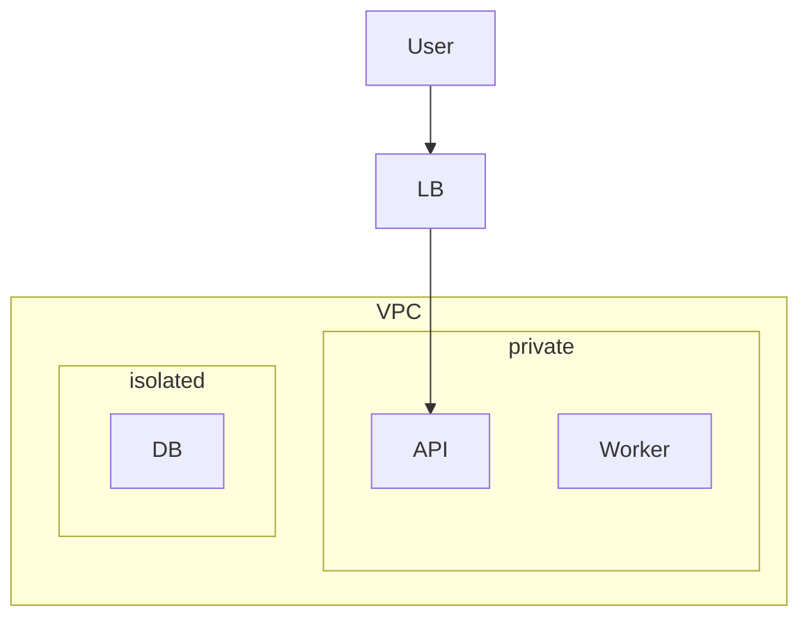

# Diagram Conventions — current-state architecture diagrams

Mermaid (default) or PlantUML. Render in the IDE / docs site, not
ASCII art. The diagram must be *parseable in 30 seconds* by someone
who has never seen the system.

## Shape vocabulary

| Concept | Mermaid syntax | Shape meaning |
|---|---|---|
| Service / app | `Foo[Foo Service]` | rectangle |
| Data store (DB / cache) | `DB[(Postgres)]` | cylinder |
| Queue / event bus | `Q>>Queue]` (or `Q{{Queue}}` for clarity) | trapezoid |
| External system | `Stripe([Stripe API])` | stadium |
| User / actor | `User((User))` | circle |
| Decision / boundary | `Auth{Auth?}` | diamond |

## Edge vocabulary

| Pattern | Mermaid | Meaning |
|---|---|---|
| Sync call | `A --> B` | request/response |
| Async / fire-and-forget | `A -.-> B` | dashed |
| Bi-directional | `A <--> B` | reserved for stateful sessions |
| Loop / retry | `A -.->|retry| B` | label edges with policy |

## (inferred) vs (confirmed) tagging

Append to the label, in italics:

```mermaid
graph LR
  API[API *(confirmed)*] --> DB[(DB *(confirmed)*)]
  API -.->|inferred| Worker[Worker *(inferred)*]
```

Or use a class:

```mermaid
classDef inferred stroke-dasharray: 5 5;
Worker[Worker]:::inferred
```

## Grouping / boundaries

Use `subgraph` for service groupings, deployment zones, security
boundaries:



## Layout direction

- **`TB`** (top → bottom) for hierarchical / control flow.
- **`LR`** (left → right) for request flow / data flow.

Pick one; stick with it within a diagram.

## Anti-patterns

- **Everything is a rectangle.** Distinct shapes per kind speed
  scanning.
- **No legend.** If `(inferred)` and `(confirmed)` appear, define
  them in the diagram caption.
- **Diagram of every component.** Aim for ~5–20 boxes per diagram.
  More than that → split into multiple diagrams (per subdomain).
- **Stale diagrams.** A diagram that hasn't been updated since
  the last architecture change is misleading. Mark `updated:` in
  the caption.
