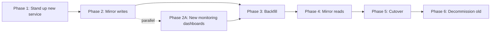

# Migration Plan — <slug>

**Version:** 1
**Locked:** YYYY-MM-DD
**Owner / conductor:** <name>
**Decision authority:** <name>
**Status:** active | draft | superseded
**Wall-clock target:** YYYY-MM-DD

---

## Context

- Assessment: [architecture-assessment.md](architecture-assessment.md) v<N>
- Chosen option: <option name>
- Critical assumption (from assessment): <e.g. "Auth API can sustain p99 < 50ms">
- Addressed pain points: <list>

---

## Phases

### Phase 1 — <verb-first name>

| Field | Value |
|---|---|
| Owner | <named — team or individual> |
| Deliverable | <specific artifact> |
| Reversible checkpoint | <state we roll back to> |
| Rollback procedure | See § Rollback below |
| Test plan | <unit / integration / perf / smoke> |
| Gate | audit / review / metric / decision — <detail> |
| Duration estimate | <weeks> |
| Risk-adjusted slack | <%> (reason: <…>) |
| Depends on | – (or prior phase) |
| Produces interface lock? | <e.g. "API contract v1 → v2 transition begins"> |

**Description.** <one paragraph>

**Critical-assumption verification** (if applicable): <how this
phase tests the assumption from the assessment>

**Rollback procedure:**

```bash
# Verbatim commands; required context; named approver; expected duration
kubectl rollout undo deployment/<service> -n staging
# Verify
kubectl rollout status deployment/<service> -n staging
```

**Interface lock notification** (if applicable):

- What freezes: <…>
- Notified parties: <internal teams / external consumers>
- Notification mechanism: <Slack channel / email / arch-breaking-change-comms>
- Lock-break procedure: <…>

---

### Phase 2 — <…>

(same shape)

---

(... up to 8 phases ...)

---

## Dependency graph



**Critical path:** P1 → P2 → P3 → P4 → P5 → P6

**Critical-path wall-clock minimum:** <N> weeks

**Slack-adjusted wall-clock estimate:** <M> weeks

---

## Sync points

### Sync point 1 — End of Phase 2 / Phase 2A

- Contributing phases: P2 + P2A
- Convergence artifact: New service ready for traffic + dashboards
  live to verify health
- Confirmed by: <conductor>
- Action if not converged: delay P3 by 1 week; re-audit P2 deliverable

---

## Interface locks

### Lock 1 — API v2 contract

- Locked at: end of Phase 1
- Downstream consumers: web client, mobile client, partner API
- Change procedure if lock breaks: re-open Phase 1; impact
  assessment; conductor approves resumption
- Notification: see `arch-breaking-change-comms` per phase
  transition

---

## Re-plan triggers

The plan is re-planned (new version) if any of:

- A phase's deliverable is rejected at its gate twice.
- A critical-path phase slips by >20%.
- A sync point's contributing phases produce incompatible
  artifacts.
- An interface lock is broken mid-phase.
- The chosen option's critical assumption proves wrong (kick
  back to `arch-assessment`).

---

## Hand-offs

- `task-breakdown` for Phase 1 tasks: see <link to tasks tar>
- `arch-rollout-strategy` for Phase 5 (cutover): see
  rollout-strategy.md
- `devops-engineer` agent for CI/CD + observability gates per
  phase
- `arch-breaking-change-comms` for Interface Lock 1
  notifications

---

## Change log

| Version | Date | Change | By |
|---|---|---|---|
| 1 | YYYY-MM-DD | initial lock | <name> |
