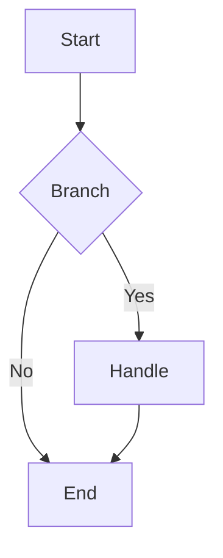

# Full Document Template

Copy and replace placeholders.

```markdown
---
id: "spec-topic-001"
title: "Document title"
aliases: ["alias1", "alias2"]
type: "spec"
category: "prd/wechat"
tags: ["tag1", "tag2"]
version: "1.0.0"
created: "2026-04-29"
updated: "2026-04-29"
author: "<author>"
status: "draft"
parent: null
children: []
related_docs:
  - id: "related-doc-001"
    relation: "related_to"
    path: "./related-doc.md"
---

# Document title

<!-- @section: overview -->
## Overview

Briefly describe the purpose and scope of this document.

<!-- @end-section -->

<!-- @section: background -->
## Background

Business background and origin of the requirement.

<!-- @end-section -->

<!-- @section: flow -->
## Process flow

Draw complex flows with Mermaid:



<!-- @end-section -->

<!-- @section: details -->
## Detail

Per-module or per-feature description.

<!-- @end-section -->

## Related

- [[related-doc-001]] — related document
- [[another-doc-001|alternate display text]] — another related document
```

---

## @section markers

```markdown
<!-- @section: architecture -->
## Architecture
...
<!-- @end-section -->
```

```markdown
<!-- @code: example-snippet -->
```go
// code example
```
<!-- @end-code -->
```

```markdown
<!-- @api: CreateOrder -->
### CreateOrder
**Method**: POST  **Path**: /api/v1/orders
<!-- @end-api -->
```

---

## WikiLink format

```markdown
<!-- correct -->
See [[spec-miniapp-product-001]]
Reference [[design-admin-order-flow-001|admin order flow]]

<!-- wrong — Graph View does not pick this up -->
See [product specification](./product.md)
```
