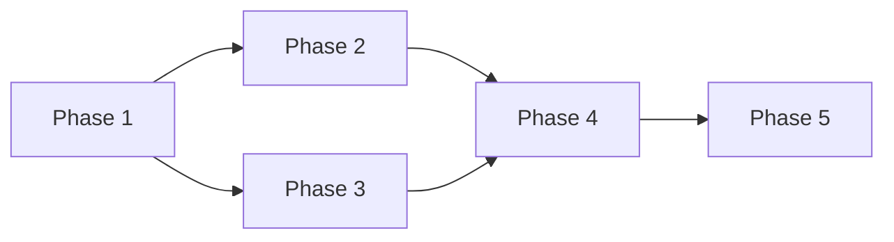

# Workflow Design — <slug>

**Version:** 1
**Locked:** YYYY-MM-DD
**Conductor:** <name or "scenario-strategist agent">
**Decision authority:** <name>
**Status:** active | draft | superseded

---

## Context

- Brief: [scenario-brief.md](scenario-brief.md) v<N>
- Chosen option: [options-analysis.md](options-analysis.md) — <Option name>
- Wall-clock target: YYYY-MM-DD

---

## Phases

### Phase 1 — <verb-first name>

| Field | Value |
|---|---|
| Owner role | <role — assigned to a specific agent in agent-group.md> |
| Deliverable | <specific artifact> |
| Gate | audit / review / metric / decision — <detail> |
| Duration estimate | <weeks> |
| Risk-adjusted slack | <%> (reason: <…>) |
| Depends on | – (or prior phase) |
| Produces (interface lock?) | <e.g. "API contract locks at end"> |

**Description.** <one paragraph; what happens in this phase>

---

### Phase 2 — <…>

(Same structure repeated.)

---

(... up to ~7 phases ...)

---

## Dependency graph

**Critical path:** Phase 1 → Phase 2 → Phase 4 → Phase 5

**Critical-path wall-clock minimum:** <N> weeks

**Slack-adjusted wall-clock estimate:** <M> weeks

---

## Parallelism

| Phases running in parallel | Coordination needed |
|---|---|
| P2 + P3 | converge at start of P4; shared artifact: <name> |

---

## Sync points

### Sync point 1 — End of Phase 3

- Contributing phases: P2, P3
- Convergence artifact: <e.g. merged spec>
- Confirmed by: <conductor>
- What happens if not converged: <e.g. delay P4 by 1 week>

---

## Interface locks

### Lock 1 — API contract

- Locked at: end of Phase 1
- Downstream consumers: Phase 2, Phase 4
- Change procedure if lock breaks: re-open Phase 1; downstream
  impact assessment; conductor approves resumption.

---

## Re-plan triggers

The workflow should be re-designed if any of the following occur:

- A phase's deliverable is rejected at its gate twice.
- A critical path phase slips by >X%.
- A sync point's contributing phases produce incompatible
  artifacts.
- An interface lock is broken (mid-phase).
- The scenario brief is re-locked.

---

## Change log

| Version | Date | Change | By |
|---|---|---|---|
| 1 | YYYY-MM-DD | initial lock | <name> |
